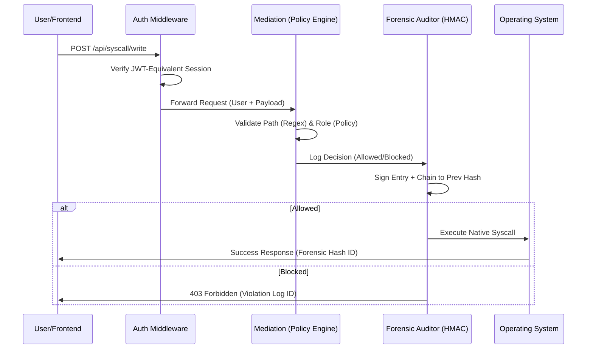

# SysCallGuardian: Deep-Dive Technical Manual

**Substantive Architecture · Cryptographic Integrity Chain · Heuristic Threat Governance**

SysCallGuardian is a high-fidelity forensic system call gateway designed to mediate, audit, and secure system-level operations. This manual provides an exhaustive breakdown of the system's logic, security protocols, and forensic infrastructure.

---

## 🏛️ 1. Architectural Blueprint

SysCallGuardian operates as an interceptor between the User/Application and the Operating System. Every request follows a strict **Triple-Lock Forensic Lifecycle**:



---

## 🛡️ 2. Security Mediation Layer

The Mediation Layer (`validation.py`) enforces strict isolation through three primary protection mechanisms:

### A. Path Sanitization & Blocklist
System-critical paths are strictly unreachable regardless of user role:
- **Restricted Directories**: `/etc/passwd`, `/etc/shadow`, `/proc`, `/sys/kernel`, `/dev`, `/boot`, `/root`.
- **Normalization**: Every path is normalized (`os.path.normpath`) to prevent bypasses via `./` or `//`.

### B. Command Whitelist (exec_process)
Only a curated list of non-destructive diagnostic tools is permitted:
- **Utilities**: `ls`, `pwd`, `whoami`, `echo`, `cat`, `head`, `tail`, `grep`, `find`, `wc`, `sort`, `uniq`.
- **Sandbox**: `python3`, `node`, `java`.
- **Diagnostic**: `hostname`, `ipconfig`, `netstat`.

### C. Injection Protection (Regex)
All command strings and paths are scanned for high-risk shell patterns:
- `; \s*rm \s` (Chained deletions)
- `\|\s*sh` (Piping to shell)
- `>\s*/etc` (Unauthorized redirects)
- `\.\.\/` (Advanced path traversal)
- `$( ... )` and `` `...` `` (Command substitution)

---

## 🔍 3. Forensic Chain-of-Trust (HMAC)

To protect the audit log from post-compromise tampering, SysCallGuardian implements a cryptographic **Chain-of-Trust**.

### The Hashing Flow
Each log entry is hashed using SHA-256 by combining its own metadata with the hash of the *previous* entry (`prev_hash`).

```python
# audit_logger.py Logic Pattern
def _hash_entry(data, prev_hash):
    payload = json.dumps({
        **data,
        "prev_hash": prev_hash
    }, sort_keys=True)
    return hashlib.sha256(payload.encode()).hexdigest()
```

### Forensic Integrity Verification
Administrators can run a **Full Chain Audit**. The verification engine reconstructs every hash in the chain. If any bit of a 1,000-entry log was modified, the chain breaks at that ID, flagging the entry as **TAMPERED**.

---

## 🧠 4. Heuristic Threat Intelligence

The Threat Intel Engine monitors real-time forensic streams to assign dynamic **Risk Scores (0-100)** to users.

| Rule ID | Name | Trigger Condition | Severity |
| :--- | :--- | :--- | :--- |
| **R2** | Syscall Flood | 5+ calls of same type in 60s | **High** |
| **R3** | Exec Violation | 1+ blocked `exec_process` attempts | **Critical** |
| **R4** | Path Probe | Access attempts to `/sys`, `/proc`, `/root` | **High** |
| **R5** | Threshold | Cumulative risk score ≥ 70 | **Critical** |

### Risk Categorization
- **0-20 (Low)**: Normal operational usage.
- **20-40 (Medium)**: Occasional errors or unusual path queries.
- **40-70 (High)**: Repeated violations; automatic dashboard flagging.
- **70-100 (Critical)**: Active threat suspected; forensic isolation recommended.

---

## 💾 5. Data Infrastructure (SQL Schema)

### Table: `users`
| Column | Type | Description |
| :--- | :--- | :--- |
| `id` | INTEGER (PK) | Unique User Identifier |
| `username` | TEXT (Unique) | Identity Handle |
| `role` | TEXT | RBAC Role (guest, developer, admin) |
| `risk_score` | REAL | Heuristic risk (0-100) |
| `is_flagged` | INTEGER (0/1) | Alert status for SOC |

### Table: `syscall_logs`
| Column | Type | Description |
| :--- | :--- | :--- |
| `id` | INTEGER (PK) | Log Sequence ID |
| `user_id` | INTEGER (FK) | Reference to `users.id` |
| `call_type` | TEXT | e.g. `file_read`, `exec_process` |
| `target_path`| TEXT | Sanitized path or command |
| `status` | TEXT | `allowed`, `blocked`, `flagged` |
| `log_hash` | TEXT | Cryptographic entry signature |
| `prev_hash` | TEXT | Chain link to previous entry |

---

## 🛰️ 6. API Manifest v1.0

### Authentication & Management
- `POST /api/auth/login`: Issue session tokens.
- `PUT /api/users/:id/role`: (Admin) Update RBAC status.
- `DELETE /api/users/:id`: (Admin) Forensic account removal (cascades to logs).

### Forensic Operations
- `GET /api/logs`: Query the forensic stream (sanitized for non-Admins).
- `GET /api/logs/verify`: (Admin) Full cryptographic chain audit.
- `GET /api/threats/events`: Live feed of heuristic detection events.

### Syscall Gateway
- `POST /api/syscall/read`: Mediated file retrieval.
- `POST /api/syscall/write`: Multi-mode write (Append/Truncate/Offset).
- `POST /api/syscall/execute`: Restricted subprocess execution.

---
**SysCallGuardian — Forensic Stability, Cinematic Security.**
*Detailed Manual for v1.0 Final Release.*
