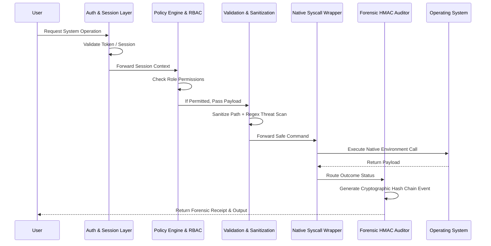

# SysCallGuardian: Deep-Dive Technical Manual

**Substantive Architecture · Cryptographic Integrity Chain · Heuristic Threat Governance**

SysCallGuardian is a high-fidelity forensic system call gateway designed to mediate, audit, and secure system-level operations. This document serves as the exhaustive breakdown of the project's folder structure, Role-Based Access Control (RBAC), security workflows, and internal architecture.

---

## 🏛️ 1. System Architecture

SysCallGuardian operates as an interceptor between the User/Application layer and the Operating System. Every request flows through a strict operational pipeline designed to stop unauthorized movements and ensure complete forensic visibility.

---

## 🗂️ 2. Comprehensive Folder & Codebase Structure

The project follows a modular, microservice-inspired monolithic layout separating interface, backend mechanics, database states, and documentation.

### `backend/` (Core Logic)
The powerhouse of the application responsible for all routing, validation, and execution.
- **`app.py`**: The main Flask application entry point. Initializes CORS, sessions, registers blueprints, and starts the core server.
- **`config.py`**: Contains environmental configurations, database URIs, secret keys, and application-level settings.
- **`auth_rbac/`**: Handles Identity and Access Management.
  - `auth_controller.py`: Core login/logout operations.
  - `roles.py`, `permission_middleware.py`: Defines the RBAC scope, enforcing route accessibility based on user tiers.
  - `session_manager.py`, `password_utils.py`: JWT-equivalent session state tracking and bcrypt password management.
  - `notification_service.py`: Dispatches email/system notifications for critical alerts.
- **`logging_detection/`**: The forensic brain of the system.
  - `audit_logger.py`: Commits standardized JSON logs to the DB.
  - `log_integrity.py`: Manages the SHA-256 HMAC cryptographic chain. Calculates the hash of previous records to secure the current log.
  - `risk_scoring.py`: Mathematical engine dynamically attributing numerical risk to behavioral patterns.
  - `threat_detection.py`: Analyzes incoming streams to identify anomalies, brute force patterns, or traversal techniques.
- **`routes/`**: Flask Blueprint definitions routing HTTP endpoints.
  - `auth_routes.py`: Endpoints for login profiles and access changes.
  - `log_routes.py`: Endpoints for fetching forensic charts and analytics.
  - `syscall_routes.py`: The interface to executing files, reading contents, and writing data.
- **`syscall_layer/`**: The bridge to the Operating System.
  - `syscall_wrapper.py` & `syscall_controller.py`: Formats user input into executable sub-process instructions.
  - `file_operations.py` & `process_operations.py`: Dedicated file manipulation and process dispatchers.
  - `validation.py`: Critical security sanitizer restricting paths (e.g. `/etc/passwd`) and parsing malicious string executions natively.
- **`database/`**: Defines the data structural layer.
  - `models.py` & `db.py`: SQLite schemas initializing Users, Permissions, Logs, and Metrics.

### `frontend/` (Cinematic User Interface)
- **`index.html`**: The unified single-page application orchestrating the entire visual experience, including terminal and dashboards.
- **`css/`**: Extensive stylesheets utilizing glassmorphism, responsive grid handling, and custom CRT-terminal themes to give a premium SOC aesthetic.
- **`js/`**: Client-side logic that interfaces with backend APIs, manages dynamic UI state changes, visualizes data using Chart.js, handles user interaction gracefully, and renders local metrics.

### `tests/` (Quality & Security Validations)
- Contains Pytest suites validating boundary access, mocking malicious payloads, verifying HMAC chain persistence, and stress-testing the routing engines.

### Root Directory Utilities
- **`reseed_users.py`**: A powerful CLI script to wipe existing development databases, create core testing accounts, establish initial HMAC audit blocks, and pre-load mock data.
- **`seed_admin.py`**: Rapidly generates default super-administrators.

---

## 🛡️ 3. Roles and Accessibility (RBAC)

The system is governed by a strict hierarchy categorizing operations. A failure to hold the requisite permission results in an immediate `403 Forbidden` response and an associated forensic threat violation log. 

### **Administrator** (`admin`)
- **System Call Access**: Full access to Whitelisted OS operations.
- **File System**: Read, Write, and Delete files.
- **Process Operations**: Execute sanitized processes via `exec_process`.
- **System Info**: Permission to view core environment stats and memory usage.
- **Log Accessibility**: Can view the *entire* forensic log history for all users. Can perform the `verify_chain` operation to cryptographically audit the logs for signs of tampering.
- **User Management**: Can create, promote, demote, or entirely purge users. Can view risk scoreboards and ban users dynamically from the system.

### **Developer** (`developer`)
- **System Call Access**: High accessibility, focused on project integration points.
- **File System**: Read, Write. Delete operations may be constrained or closely monitored.
- **Process Operations**: Permitted to run basic diagnostic flags and compilation actions (`node`, `python3`).
- **Log Accessibility**: Can view *only their own logs*. Cannot view system-wide charts, other users' activity, or access the HMAC validation features.
- **Restrictions**: Cannot alter user permission levels or clear risk scores.

### **Guest** (`guest`)
- **System Call Access**: Severely sandboxed.
- **File System**: **Read-Only**. Permitted to `dir_list` and `file_read` in non-restricted paths.
- **Process Operations**: Explicitly denied. Any attempt dynamically spikes their Threat Risk Score.
- **Log Accessibility**: Can view *only their own logs* for transparency.
- **Restrictions**: Blocked from modifying the environment in any capacity.

---

## 🔒 4. Deep-Dive: Core Components & Security Guardrails

### A. The Validation Engine (`validation.py`)
No command hits the OS without passing three firewall layers:
1. **Directory Blocklists**: Prevents traversal into structural hierarchies: `/etc/shadow`, `/proc`, `/sys`, `/boot`, and Windows equivalents (`C:\Windows\System32`).
2. **Command Whitelists**: Non-destructive commands are natively approved (`ls`, `pwd`, `grep`, `echo`).
3. **Regex Injection Protection**: Identifies and terminates chained instructions (`rm -rf`, piped strings `| sh`, or command substitutions `$(...)`).

### B. Forensic Chain of Trust (HMAC Logging)
SysCallGuardian mimics blockchain principles for immutable data tracing:
- When Log `N` is created, its payload (User, Action, Result) is serialized and bundled with `Log(N-1)`'s `log_hash`.
- A SHA-256 process mints a new, unique signature.
- If a bad actor modifies a database row directly (e.g., altering a `Blocked` operation to `Allowed`), the `verify_chain` tool recalculates the hashes. The mismatch will break the chain violently, raising an immediate Administrator alert highlighting the exact tampered row.

### C. Heuristic Risk Engine
Each user carries a living risk score from `0` to `100`.
- Standard anomalies (a misspelled directory) might add `+2` to the score.
- Severe malicious actions (attempting an `exec_process` injection limit) will add `+20`.
- Crossing threshold lines automates responses. At `40 (High)`, their UI turns amber and their logs are hyper-analyzed. At `70 (Critical)`, the user is flagged for Immediate Admin Review and their capability to execute any command is paused.

---

## 💾 5. Database Matrix

**Table: `users`**
Tracks immutable identity data, risk profiles, email contacts, and role references. Tracks real-time session identifiers to prevent multi-device token abuse.

**Table: `syscall_logs`**
The core historical repository. Requires Foreign Key linkage to a valid `user_id`. Stores the `call_type`, the sanitized `target_path`, the resulting `status`, and specifically archives the `log_hash` and `prev_hash` to assert continuity.

**Table: `threat_events`**
Discrete metrics tables archiving specific behavior anomalies generated by the heuristic engine, decoupled from standard syscall transactions for lightweight reporting.

---

## 🌐 6. API Route Contracts

The gateway relies on standardized JSON payloads across REST boundaries.

### Authentication Space
- `POST /api/auth/login` - Validates credentials.
- `POST /api/auth/logout` - Terminates backend session strings.
- `POST /api/auth/verify` - Validates persistent session health.

### Syscall Interception Layer
- `POST /api/syscall/read` - `{ "path": "/path/to/target" }`
- `POST /api/syscall/write` - `{ "path": "/target", "content": "data", "mode": "w|a" }`
- `POST /api/syscall/execute` - `{ "command": "whoami" }`

### Remote Logging & Integrity
- `GET /api/logs` - Context-aware fetch (Admin fetches all; Developers fetch self).
- `GET /api/logs/summary` - Aggregated metrics for Data Visualization.
- `GET /api/logs/verify_chain` - Recalculates all hashes to confirm database state integrity.

---
*End of Protocol Manual.*
*Developed by the SysCallGuardian Engineering Team.*
