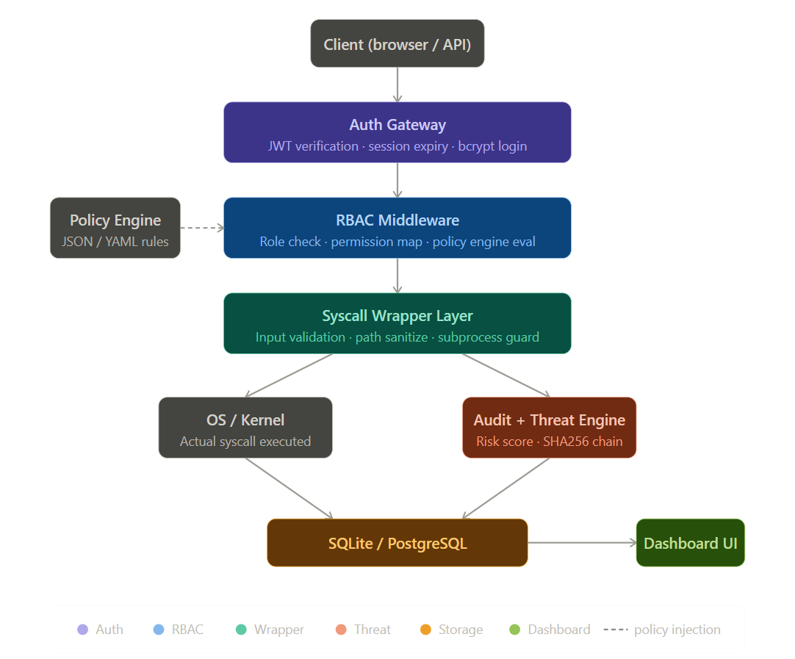
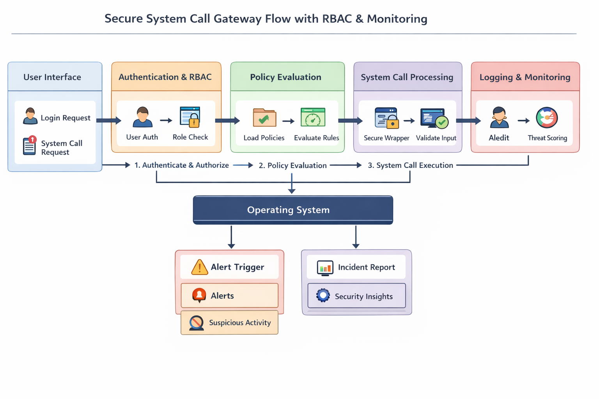

# SysCallGuardian — Professional System Call Gateway


**SysCallGuardian** is a high-performance, security-focused system call gateway designed to monitor, filter, and audit system-level operations in real-time. It provides a centralized dashboard for administrators to enforce granular security policies across a multi-user environment.

---

## 🏛️ Technical Architecture

SysCallGuardian acts as a high-fidelity mediation layer between user applications and the host operating system. Every request is scrubbed, validated, and cryptographically signed before execution.


*Figure 1: High-level System Call Interception and Forensic Pipeline.*


*Figure 2: Comprehensive Request Lifecycle with RBAC and Policy Evaluation.*

---

## 🚀 Quick Start

### 1. Prerequisites
- Python 3.8 or higher
- SQLite3

### 2. Installation
```bash
# Clone the repository
git clone https://github.com/your-repo/secure-syscall-gateway.git
cd secure-syscall-gateway

# Set up virtual environment
python -m venv venv
source venv/Scripts/activate  # venv/bin/activate on Linux/macOS

# Install dependencies
pip install -r requirements.txt
```

### 3. Initialize Database
```bash
# Seed the database with core users and roles
python reseed_users.py
```

### 4. Run the Application
```bash
cd backend
python app.py
```
The gateway will be active at `http://127.0.0.1:5000`.

---

## 🔐 Core User Credentials (Test Accounts)

| Role | Username | Password | Purpose |
| :--- | :--- | :--- | :--- |
| **Admin** | `Tejax` | `U@itej99x` | Security oversight & Policy management |
| **Developer** | `Vancika` | `Van112358` | Application development & Debugging |
| **Guest A** | `GuestA` | `Guest@123` | Restricted trial access (Read-only) |
| **Guest B** | `GuestB` | `Guest@456` | Restricted trial access (Read-only) |

---

## ✨ Key Features & Real-world Implementation

### 🛡️ 1. Security Mediation Layer
The system uses `syscall_layer/validation.py` to enforce strict isolation via:
- **Path Sanitization**: Prevents access to `/etc/passwd`, `/etc/shadow`, `/proc`, `/sys/kernel`, and more.
- **Command Whitelisting**: Only trusted utilities (e.g., `ls`, `grep`, `python3`, `node`) are permitted for `exec_process`.
- **Injection Protection**: Regex-based detection of shell patterns like `; rm`, `| sh`, and `$(...)`.

### 🔍 2. Digital Forensic Chain (HMAC)
To ensure audit log integrity, every event is cryptographically linked in `logging_detection/log_integrity.py`:
- **SHA-256 Hashing**: Each log entry is hashed with the `prev_hash` of the preceding entry.
- **Chain Verification**: Administrators can run a full-chain audit to detect any tampering in the history.
- **Tamper Alerting**: The UI flags specific log IDs if their cryptographic signature fails verification.

### 🧠 3. Heuristic Threat Intelligence
Real-time risk scoring is computed in `logging_detection/risk_scoring.py`:
- **Dynamic Delta**: High-risk attempts (like `exec_process` violations) add more risk (+15.0) than simple read blocks (+3.0).
- **Risk Thresholds**: Users are automatically flagged as **High** (40+) or **Critical** (70+) based on cumulative behavior.
- **SOC Dashboard**: A live feed of heuristic events with status-aware log coloring.

---

## 📁 Project Anatomy

```text
secure-syscall-gateway/
├── backend/                # Flask Core & Security Engines
│   ├── auth_rbac/          # JWT & Role-Based Access Control
│   ├── logging_detection/  # Forensic Chain & Risk Scoring
│   ├── policy_engine/      # JSON/YAML Security Policies
│   ├── routes/             # API Endpoints (Auth, Syscalls, Logs)
│   └── syscall_layer/      # Validation & Native Interception
├── frontend/               # CRT Terminal UI (HTML/JS/CSS)
│   ├── css/                # Cinematic Styling & CRT Effects
│   └── js/                 # Terminal Logic & API Integration
├── docs/                   # Technical Manuals & Diagrams
├── tests/                  # Pytest Forensic Suite
└── database/               # SQLite Schema & Migration Logic
```

---

## 📖 Documentation
For a deep dive into the architecture, security protocols, and development roadmap, please refer to the [PROJECT_OVERVIEW.md](PROJECT_OVERVIEW.md).

---
*Developed by the SysCallGuardian Engineering Team*